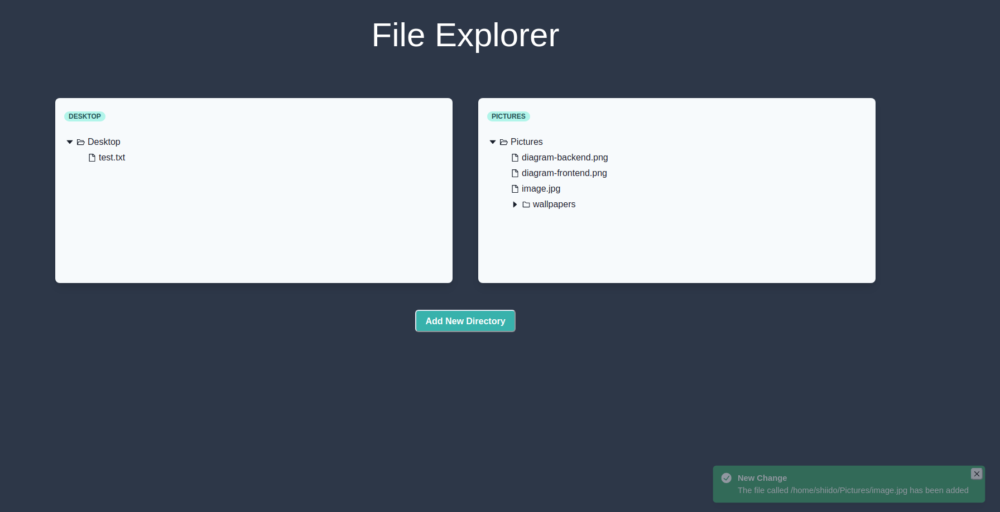

<p align="center">
  
</p>

# Description

Application that allows you to monitor directories and files in real time.

The application is divided into two parts:

## Backend

The backend was built under NestJS framework and allows:

- Handle client connections through websockets
- Check if folders and files are valid
- Monitoring folders and files in real time

For further details [Click Here!](./file-explorer-backend/README.md)

## Frontend

The frontend was built under React framework and allows:

- View the changes that have occurred in the directories that are under monitoring in real time
- Add new directories to monitor

For further details [Click Here!](./file-explorer-frontend/README.md)

# Requirements

- node **v10.15.3** or higher
- npm **v6.4.1** or higher

It is important that you do not have any connection on ports **3011**, **8081** and **3000**

# Technologies

- TypeScript
- Clean architecture
- DDD
- [NestJS](https://nestjs.com/)
- [Socket.IO](https://socket.io/)
- [React](https://reactjs.org/)
- [Redux](https://redux.js.org/)
- [Chakra](https://chakra-ui.com/)

# Installation

```bash
$ npm install
```

# Running

```bash
$ node file-explorer.js ~/Desktop
```

The backend server will start here: http://localhost:3011

The websocket server will start on port **8081**

The frontend app will open here: http://localhost:3000

# Test

```bash
# Backend
$ cd file-explorer-backend && npm run test:cov

# Frontend
$ cd file-explorer-frontend && npm run test
```

# Preview



# License

File-Explorer is [MIT licensed](LICENSE).
