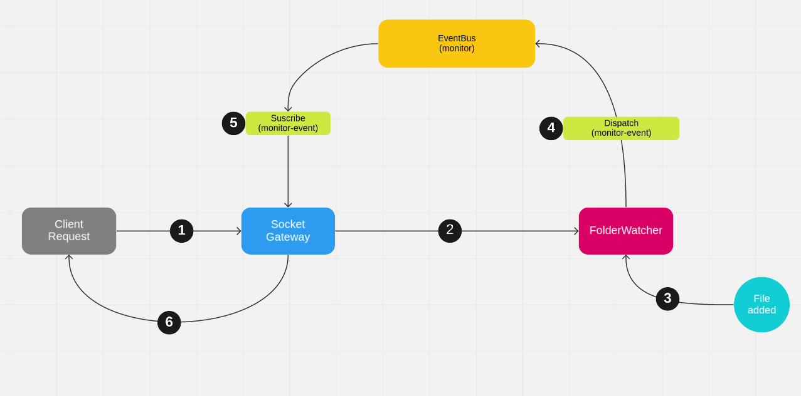

<p align="center">
  
</p>

# Description

Backend Server allows:

- Handle client connections through websockets
- Check if folders and files are valid
- Monitoring folders and files in real time

# Requirements

- node **v12.16.3**
- npm **v6.14.4**

# Technologies

- [NestJS](https://nestjs.com/)
- [Socket.IO](https://socket.io/)
- Clean architecture
- DDD
- TypeScript

# Folder Monitoring Workflow

The flow carried out to monitor a directory is described below:



1. A client requests to monitor a specific folder
2. Socket-Gateway verifies and sends the request to Folder-Watcher use case to start monitoring
3. Folder-Watcher detects when a file or directory is added, deleted or renamed
4. Folder-Watcher dispatch an event with data to the Event-Bus
5. Event-Bus notifies to Socket-Gateway change has occurred
6. Socket-Gateway broadcasts the changes to all connected sockets

## Installation

```bash
$ npm install
```

## Running the server

```bash
$ npm run start
```

The server will start here: http://localhost:3011

## Test

```bash
# unit tests
$ npm run test

# test coverage
$ npm run test:cov
```

## License

File-Explorer Backend is [MIT licensed](LICENSE).