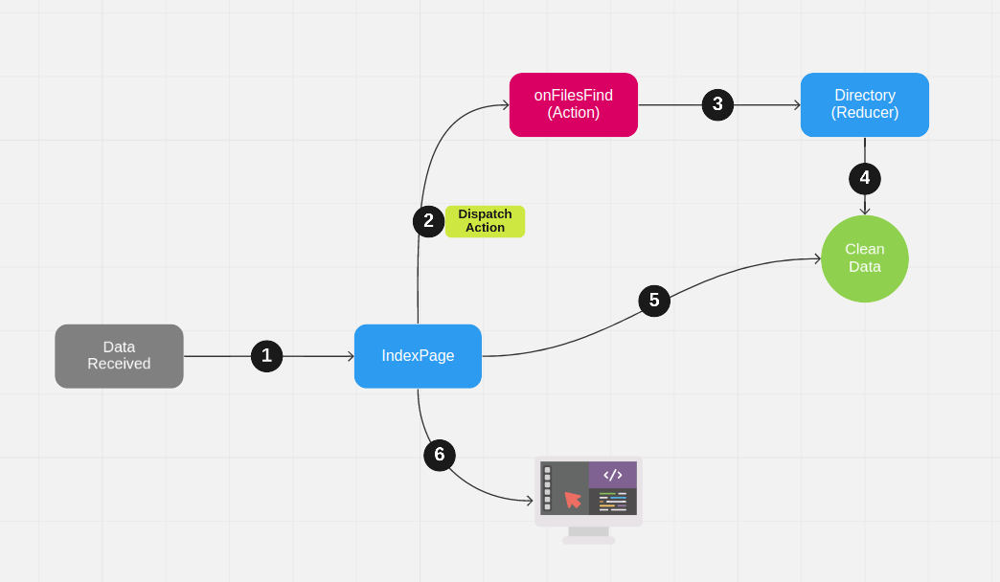

<p align="center">
  
</p>

# Description

Frontend App allows:

- View the changes that have occurred in the directories that are under monitoring in real time
- Add new directories to monitor

# Requirements

- node **v10.15.3** or higher
- npm **v6.4.1** or higher

It is important that you do not have any connection on port **3000**

# Technologies

- [React](https://reactjs.org/)
- [Socket.IO](https://socket.io/)
- [Redux](https://redux.js.org/)
- [Chakra](https://chakra-ui.com/)
- TypeScript

# Receive Data Workflow

The flow carried out to view a directory that it is under monitoring is described below:



1. The home component receives the data from the websocket server
2. The home component dispatch an action to filter data
3. The reducer receives the data
4. The reducer filters the data
5. The home component detects the new data
6. Finally the home component render the page with the new data

# Installation

```bash
$ npm install
```

# Running the app

```bash
$ REACT_APP_FOLDERS=/home npm start
```

The app will open here: http://localhost:3000

# Test

```bash
$ npm test
```

# License

File-Explorer Frontend is [MIT licensed](LICENSE).
